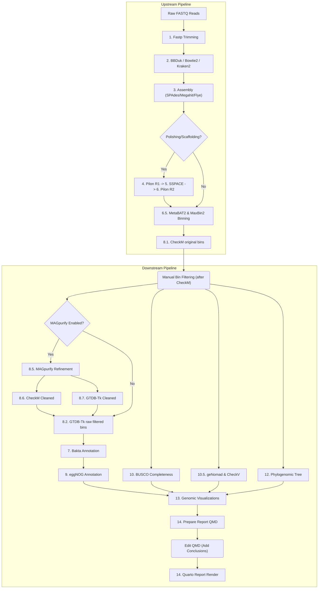

# Bacterial WGS Analysis Pipeline 

A modern, reproducible, and configuration-driven bacterial Whole Genome Sequencing (WGS) pipeline orchestrated with **Pixi** and **SLURM**.

---

## Table of Contents
1. [Pipeline Overview](#pipeline-overview)
2. [Prerequisites & Setup](#prerequisites--setup)
3. [Configuration (`config.sh`)](#configuration-configsh)
   * [Feature Toggles (On/Off Tutorial)](#feature-toggles-onoff-tutorial)
4. [Downloading Reference Databases](#downloading-reference-databases)
5. [Step-by-Step Usage Tutorial](#step-by-step-usage-tutorial)
   * [Step 1: Generate Input Sheet](#step-1-generate-input-sheet)
   * [Step 2: Run Master Workflow](#step-2-run-master-workflow)
   * [Step 3: Build Reference Trees](#step-3-build-reference-trees)
6. [Pipeline Features & Modules](#pipeline-features--modules)
   * [What the Final Quarto Report Contains](#what-the-final-quarto-report-contains)
7. [Job Resume & Checkpoint Logic](#job-resume--checkpoint-logic)

---

## Pipeline Overview

This pipeline automates short-read bacterial genome assembly, polishing, scaffolding, quality check, taxonomic classification, gene prediction, plasmid/viral identification, and functional annotation.



---

## Prerequisites & Setup

Ensure you have [Pixi](https://pixi.sh/) installed on your Linux system. If not, install it via:
```bash
curl -fsSL https://pixi.sh/install.sh | bash
```
Restart your shell after installation.

Initialize the environments and install all pipeline dependencies automatically:
```bash
# Clone the repository
git clone https://github.com/huyha1314/WGS_pipeline.git
cd WGS_pipeline

# Solve and install all environment feature-sets (QC, Assembly, Annotation, Taxonomy, etc.)
pixi install --all
```

---

## Configuration (`config.sh`)

All project-wide settings, directories, computer resources, and tool arguments are managed in [config.sh](config.sh). Open and edit this file to suit your system resources.

Key variables in `config.sh`:
*   `BATCH_NAME`: Set a custom name for the batch run (defaults to the timestamp of the run). This name prefixes phylogenetic trees, genomic visualization files, and the Quarto report.
*   `DB_DIR`: Default path for all databases, set to `/worker_data1/huyha/db`.
*   `CPUS_MAX` / `CPUS_MED` / `CPUS_MIN`: CPU allocations for the Slurm jobs.
*   `ASSEMBLER`: Choice of de novo assembler (`spades`, `megahit`, `flye`).
*   `RUN_POLISHING` / `RUN_SCAFFOLDING`: Toggles to enable/disable Pilon and SSPACE steps.
*   `FASTP_*` / `BBDUK_*` / `MEGAHIT_*`: Parameters for the bioinformatics tools.

### Feature Toggles (On/Off Tutorial)

The pipeline is fully modular. You can selectively enable or disable functional modules by changing their boolean values (`true` or `false`) in the `config.sh` file:

```bash
# --- Analysis Toggles ---
RUN_POLISHING="true"      # Run Pilon error correction
RUN_SCAFFOLDING="true"     # Run SSPACE scaffolding
RUN_MAXBIN="true"          # Run MaxBin2 alongside MetaBAT2 (highly recommended for complex samples)
RUN_MAGPURIFY="true"       # Run MAGpurify outlier contig removal (MAG refinement)

# --- NEW: Functional Analysis Toggles ---
RUN_AMR_VIRULENCE="true"   # Toggle AMR & virulence gene detection (via ABRicate)
RUN_ANTISMASH="true"       # Toggle Biosynthetic Gene Cluster (BGC) detection (via antiSMASH)
RUN_BAGEL4="true"          # Toggle Bacteriocin & RiPP peptide mining (via BAGEL4)
```

*   **To turn off a feature** (e.g. antiSMASH or Pilon): Open `config.sh`, set `RUN_ANTISMASH="false"`, save the file, and run the pipeline.
*   **Checkpoint recognition**: If a module is toggled to `false`, the pipeline workflow wrapper will automatically skip it and provide the correct mock output dependencies to downstream tasks so they proceed without failure.

---

## Downloading Reference Databases

Large reference databases are downloaded directly to `/worker_data1/huyha/db` using multi-connection `aria2c` for maximum speed.

> [!IMPORTANT]
> Always run tasks using **`pixi run <task-name>`**. Running `pixi <task-name>` without `run` will result in an unrecognized subcommand error.

Run the corresponding command to download and extract the required databases:

```bash
# 1. GTDB-Tk Reference Database (~100 GB)
pixi run download-db-gtdbtk

# 2. Bakta Annotation Database (~40 GB)
pixi run download-db-bakta

# 3. CheckV Viral Database (~1.5 GB)
pixi run download-db-checkv

# 4. CheckM Marker Database (~1.4 GB)
pixi run download-db-checkm

# 5. geNomad Plasmid/Virus Database (~10 GB)
pixi run download-db-genomad

# 6. eggNOG Functional Annotation Database (~15 GB)
pixi run download-db-eggnog

# 7. Kraken2 PlusPF (Fungi & Protozoa) Database (~75 GB compressed)
pixi run download-db-kraken2

# 8. AMR & Virulence Databases (CARD, ResFinder, VFDB) (~1.5 GB)
pixi run download-db-amr-virulence

# 9. Secondary Metabolite & Bacteriocin Databases (antiSMASH & BAGEL4 Pfam-A) (~10 GB)
pixi run download-db-secondary-metabolites
```

### Checking Database Status
You can verify the download, extraction, and readiness status of all reference databases at any time by running:
```bash
./script/verify_databases.sh
```

---

## Step-by-Step Usage Tutorial

### Step 1: Generate Input Sheet
Scan your raw fastq folder to pair forward and reverse reads and automatically generate a `samples.tsv` file:
```bash
pixi run create-sheet -i data/20260509 -o samples.tsv
```
This produces a tab-separated sheet containing three columns:
1.  `name`: Sample unique identifier.
2.  `path_R1`: Absolute path to forward read file.
3.  `path_R2`: Absolute path to reverse read file.

### Step 2: Run Master Workflow

#### Option A: Slurm Cluster Mode (Recommended for cluster environments)
Submit all pipeline modules (from Quality Control to Assembly, Scaffolding, Annotation, Phylogeny, Visualization, and Quarto HTML rendering) to the SLURM cluster scheduler. Job dependency tracking is handled automatically:
```bash
./script/11.masterworkflow.sh
```
To monitor your submitted Slurm jobs, run:
```bash
squeue -u $USER
```

#### Option B: Standalone Local Mode (Fallback for local machines or drained nodes)
If the Slurm scheduler is unavailable, offline, or nodes are drained, you can execute the entire pipeline sequentially directly on the local high-performance node (this automatically activates the pixi default environment with all tools like GNU Parallel and pigz):
```bash
pixi run run-pipeline-local
```

#### Option C: Two-Stage Run with Manual Bin Filtering (Recommended)
If you want to review the MetaBAT2 & MaxBin2 bin quality using CheckM to filter out poor-quality bins/assemblies before running the downstream taxonomic classification, annotation, and phylogenomic steps:

##### 1. Run the Upstream Pipeline
This executes QC, assembly, polishing, scaffolding, binning, and CheckM quality assessment, then pauses.
```bash
# Standalone local run:
pixi run run-pipeline-local-upstream

# Slurm cluster run:
./script/11.masterworkflow_upstream.sh
```

##### 2. Review and Filter Bins
1. Open and inspect the CheckM quality metrics (`results/checkm/checkm_summary.txt`).
2. Navigate to the collected assemblies directory:
   `cd results/collected_assemblies`
3. Delete or move out any bins or chromosomal assemblies you wish to exclude (e.g., bins with low completeness or high contamination):
   `rm <poor_quality_bin_name>.fasta`

##### 3. Run the Downstream Pipeline
This cleans up previous downstream folders to align with your filtered list of bins and executes the remaining classification, annotation, and analysis steps (GTDB-Tk taxonomic classification, Bakta, EggNOG, BUSCO, geNomad, Phylogeny tree, and genomic drawing). It then prepares the Quarto report template (`results/rp/14.rp.qmd`) and pauses.
```bash
# Standalone local run:
pixi run run-pipeline-local-downstream

# Slurm cluster run:
./script/11.masterworkflow_downstream.sh
```

##### 4. Edit Quarto Report & Render
1. Open the file:
   `results/rp/14.rp.qmd` (if you want to add further customization before rendering, though the pipeline now auto-generates a detailed biological summary table and insights in `Conclusion / Batch Summary`).
2. Navigate to the `# Conclusion / Batch Summary` section at the bottom to write your custom conclusions/explanations if desired.
3. Save the file.
4. Render the final HTML report and generate compressed archives:
   `bash script/14.render_report.sh`

Once the render job completes, the pipeline automatically cleans up the intermediate `14.rp.qmd` file from the `results/rp/` directory to keep the export package clean, and outputs:
*   `results/rp/14.rp.html` (The interactive HTML dashboard)
*   `results/rp.zip` (Compressed ZIP archive of the report, excluding `.qmd`)
*   `results/rp.tar.gz` (Compressed tarball of the report, excluding `.qmd`)

### Step 4: Specific Species Assembly (Optional Feature)
If your sample is contaminated or contains multiple organisms, and you want to extract and assemble ONLY the reads belonging to a specific taxon (e.g., a particular species or genus):

1. Run the extraction task to isolate reads matching a specific taxonomic ID:
   ```bash
   pixi run filter-reads -s <source_sample> -t <taxon_id> -o <new_sample_name> [-g <genus>] [-p <species>]
   ```
   *Example*: Extract only *Bacillus* reads (Taxon ID `1392`) from sample `243` and register a new sample `243_bacillus`:
   ```bash
   pixi run filter-reads -s 243 -t 1392 -o 243_bacillus -g Bacillus -p subtilis
   ```

2. This will:
   * Perform Kraken2 taxonomic classification on the source sample (if not already done).
   * Extract only reads classified under the specified taxon ID and its children.
   * Save the filtered reads as a new gzipped fastq pair in `data/` (e.g. `data/243_bacillus_R1.fastq.gz` and `data/243_bacillus_R2.fastq.gz`).
   * Automatically register the new sample `243_bacillus` in `samples.tsv` with the specified Genus and Species.

3. Process the new sample through the pipeline from assembly onwards:
   ```bash
   pixi run run-pipeline-local-upstream
   ```

---

## Pipeline Features & Modules

### 🧼 Quality Control & Filtering
*   **Trimming**: [1.fastp.sh](script/1.fastp.sh) performs adapter removal, quality-sliding windows, and low-quality filtering.
*   **Contaminant Removal**: [2.bbduk.sh](script/2.bbduk.sh) filters out low-entropy/sequence-artifact reads, runs `Bowtie2` to filter out human host reads (e.g. hg38), and classifies taxonomic reads with `Kraken2`.

### 🧬 Genome Assembly & Polishing
*   **De Novo Assembly**: [3.assembly.sh](script/3.assembly.sh) runs de novo assembly using the selected tool (`spades`, `megahit`, or `flye`).
*   **Polishing**: [4.pilon.sh](script/4.pilon.sh) maps clean reads back to assemblies using `bwa` and corrects mismatches and indels via Pilon (automatically skipped when `RUN_POLISHING=false`).
*   **Scaffolding**: [5.sspaces.sh](script/5.sspaces.sh) scaffolds contigs using SSPACE (automatically skipped when `RUN_SCAFFOLDING=false`).
*   **Final Correction**: [6.pilon_ss.sh](script/6.pilon_ss.sh) runs a second round of polishing (automatically skipped when `RUN_POLISHING=false`).

### 🧬 Genome Binning & Contaminant Refinement
*   **Binning & Consensus Refinement**: [6.5.metabat2.sh](script/6.5.metabat2.sh) runs MetaBAT2 and optionally MaxBin2 (enabled via `RUN_MAXBIN=true`) to bin polished contigs. It then automatically executes **DAS Tool** using the `diamond` search engine to evaluate both binner outputs, extract the best single-copy core genes, and merge them into a single highly-purified set of bins.
*   **Quality Stats (Original Bins)**: [8.1.checkm.sh](script/8.1.checkm.sh) collects all bins from MetaBAT2 and MaxBin2 into the `collected_assemblies` directory, runs CheckM to assess genome quality (completeness/contamination), and classifies taxonomy using GTDB-Tk.
*   **Automated Bin Refinement**: [8.5.magpurify.sh](script/8.5.magpurify.sh) runs MAGpurify to flag and discard outlier contigs (based on GC content, tetranucleotide frequencies, and conflicting phylogenetic clade markers).
*   **Post-Cleaning Verification**: [8.6.checkm_cleaned.sh](script/8.6.checkm_cleaned.sh) runs CheckM and GTDB-Tk on cleaned assemblies to verify that contamination dropped below 5% and finalize taxonomy.

### 🏷️ Genome Annotation & Downstream Analysis
*   **Gene Annotation**: [7.bakta.sh](script/7.bakta.sh) runs Bakta on the refined main bins to predict coding sequences (CDS), tRNAs, rRNAs, and annotate them.
*   **Functional Annotation**: [9.eggnog.sh](script/9.eggnog.sh) predicts functional classes and GO terms using Diamond alignments against the eggNOG database.
*   **Completeness**: [10.busco.sh](script/10.busco.sh) checks genome assembly completeness against conserved single-copy orthologs.
*   **Plasmids & Viruses**: [10.5.plasmid_prediction.sh](script/10.5.plasmid_prediction.sh) runs geNomad on the refined bins to identify plasmids or viral contigs and evaluates virus qualities with CheckV.
*   **AMR & Virulence**: [10.6.amr_virulence.sh](script/10.6.amr_virulence.sh) runs ABRicate against CARD, ResFinder, and VFDB to detect AMR genes and virulence factors (automatically skipped when `RUN_AMR_VIRULENCE=false`).
*   **Secondary Metabolites & Bacteriocins**: [10.7.secondary_metabolites.sh](script/10.7.secondary_metabolites.sh) runs antiSMASH on Bakta-annotated GenBank files and BAGEL4 on assembly fasta files (automatically skipped when toggles are false).

---

## What the Final Quarto Report Contains

The pipeline compiles all analysis metrics into an interactive, self-contained HTML Quarto dashboard (`results/rp/14.rp.html`) containing the following sections:

1.  **Quality Control**: Displays interactive `MultiQC` reports covering sequencing raw reads trimming, adapter contamination, base quality scores, and duplication levels.
2.  **Taxonomic Abundance Profile (Kraken2)**: Embedded stacked barplot and taxonomic abundance table of reads mapping.
3.  **Genome Assembly Stats & Annotation (Bakta)**: Complete assembly properties (lengths, N50s, L50s, GC %) alongside Bakta's annotations (CDS, rRNA, tRNA, tmRNA count).
4.  **Assembly Taxonomy & Quality**: Visual summaries of genome completeness, contamination (via CheckM), and the resolved GTDB-Tk taxons.
5.  **BUSCO Completeness Assessment**: Evolutionary completeness profile plots and metrics.
6.  **Functional Annotation (COG & KEGG)**: Dynamic COG category distribution charts and searchable, sorted KEGG pathways/metabolic networks.
7.  **Plasmid & Virus Prediction**: geNomad and CheckV outputs of predicted mobile genetic elements (MGEs), viral quality classifications, and completeness.
8.  **Antimicrobial Resistance & Virulence Genes**: Brand-aligned, interactive tables (with DT sorting, pagination, and search) showing hits against **CARD**, **ResFinder**, and **VFDB** databases.
9.  **Secondary Metabolites & Bacteriocins**: Embedded interactive HTML reports from **antiSMASH** (listing Biosynthetic Gene Clusters, BGCs) and **BAGEL4** (identifying bacteriocins, RiPPs, PKS, and NRPS clusters).
10. **Phylogenetic Analysis**: Evolutionary placement tree built using IQ-TREE with bootstraps.
11. **Conclusion & Batch Summary**: Automatically generated summary table mapping taxonomic classification, completeness, size, plasmid count, and provirus count for the entire batch. Note: Tables are structured natively in responsive HTML to completely prevent Quarto's mobile-view "squash" effect, maintaining the universal `#148F77` styling.

### 📝 Project-Specific Custom Reports
The pipeline architecture natively supports generating highly customized, client-specific reports while keeping the universal core completely pristine.
*   **Universal Core (`14.rp.qmd`)**: The clean, generalized genomic analysis template that runs for every batch.
*   **Specialized Projects (e.g., `14.rp_purine_project.qmd`)**: Custom, duplicate versions of the QMD template that inject highly-specialized project logic (e.g., Targeted Trait Matrices for Purine Transport/Salvage, Uric Acid Degradation, and Hemolysin/Biosafety checks). Both the universal and special reports compile simultaneously and are cleanly packaged into the final `rp.zip` deliverable without retaining source files.

---

## Job Resume & Checkpoint Logic

The pipeline is fully resume-compatible. If the workflow is interrupted or a node fails:
1.  Edit `samples.tsv` or your configurations if needed.
2.  Relaunch `./script/11.masterworkflow.sh` (or `pixi run run-pipeline-local` if running locally).
3.  The master script will look for checkpoint files (e.g., `.gbff` for Bakta, `.fasta` for Pilon, `checkm_summary.txt` for CheckM).
4.  Completed tasks will be **skipped**, and only failed/incomplete steps will be processed.

---

## Troubleshooting & Known Issues

### 1. GTDB-Tk / Skani Database "index out of range for slice" Panic
*   **Symptom**: During step 8 (`CheckM & GTDB-Tk`), GTDB-Tk fails with a Rust panic from the underlying `skani` tool:
    ```text
    thread '<unnamed>' panicked at src/sketch_db.rs:114:35:
    range start index XXXXXXXX out of range for slice of length 54843010048
    ```
*   **Cause**: This error occurs when the GTDB-Tk reference database file `sketches.db` is truncated or corrupted on disk (for example, if a previous download or extraction was interrupted or ran out of disk space). Skani memory-maps the truncated file, but then tries to look up offsets from the index that extend beyond the truncated file size (which is 54,843,010,048 bytes when truncated instead of the complete 75,270,701,831 bytes).
*   **Fix**:
    Re-extract the `sketches.db` file from the downloaded `gtdbtk_data.tar.gz` archive. You can do this by running:
    ```bash
    # Rename/backup the truncated file
    mv /worker_data1/huyha/db/gtdbtk/skani/database/sketches.db /worker_data1/huyha/db/gtdbtk/skani/database/sketches.db.truncated
    
    # Extract the complete sketches.db file (parallelized using pigz)
    pixi run tar -I pigz -xvf /worker_data1/huyha/db/gtdbtk_download/gtdbtk_data.tar.gz -C /worker_data1/huyha/db/gtdbtk --strip-components=1 release232/skani/database/sketches.db
    
    # Verify the extracted size is 75,270,701,831 bytes (approx. 71 GB)
    stat --format="%s" /worker_data1/huyha/db/gtdbtk/skani/database/sketches.db
    
    # Clean up the backup
    rm /worker_data1/huyha/db/gtdbtk/skani/database/sketches.db.truncated
    ```
